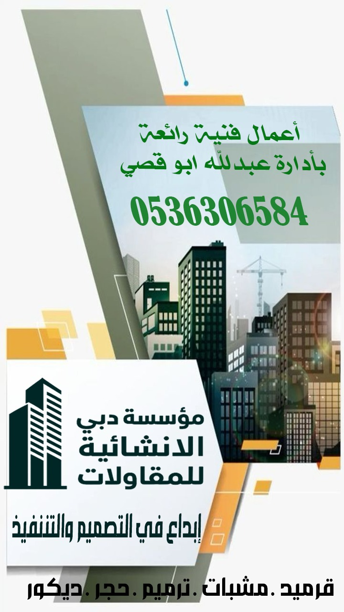
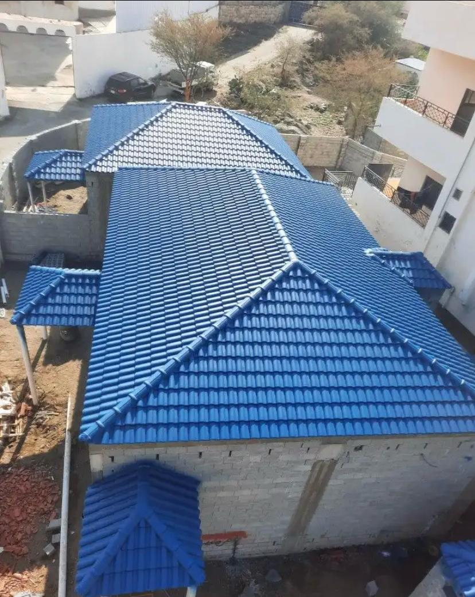
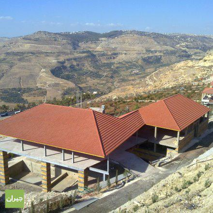
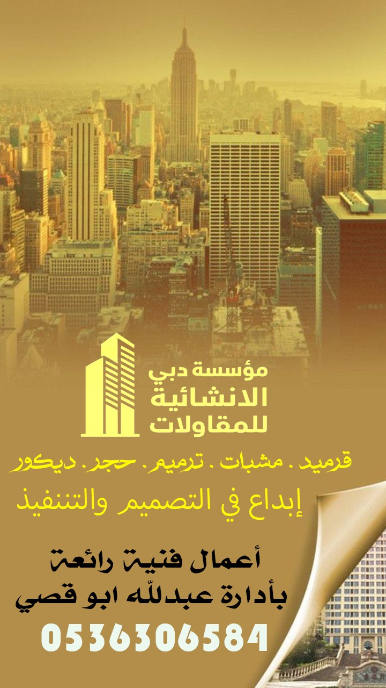

<!DOCTYPE html>
<html lang="ar" dir="rtl">
<head>
    <meta charset="UTF-8">
    <meta name="viewport" content="width=device-width, initial-scale=1.0">
    <title>مؤسسة دبي الإنشائية | البناء بمعايير الجودة</title>
    <link rel="stylesheet" href="https://cdnjs.cloudflare.com/ajax/libs/font-awesome/6.4.0/css/all.min.css">
    
</head>
<body>
    <!-- Header -->
    <header>
        

            

                <h1>مؤسسة دبي الإنشائية</h1>
            

            <nav>
                <ul>
                    <li><a href="#home">الرئيسية</a></li>
                    <li><a href="#about">من نحن</a></li>
                    <li><a href="#services">خدماتنا</a></li>
                    <li><a href="#projects">مشاريعنا</a></li>
                    <li><a href="#contact">اتصل بنا</a></li>
                </ul>
            </nav>
        

    </header>
    <!-- Hero Section -->
    <section class="hero" id="home">
        

            <h2>بناء مستقبل أفضل مع مؤسسة دبي الإنشائية</h2>
            
نحن نقدم حلولاً إنشائية مبتكرة تلبي أعلى معايير الجودة والسلامة، مع الالتزام بمواعيد التسليم وتقديم أفضل الخدمات لعملائنا في المملكة العربية السعودية.

            <a href="#contact" class="cta-button">اتصل بنا الآن</a>
            <a href="#projects" class="cta-button">شاهد مشاريعنا</a>
        

    </section>
    <!-- About Section -->
    <section class="about" id="about">
        

            

                <h2>من نحن</h2>
            

            

                

                    <h3>رواد في مجال الإنشاءات منذ أكثر من 15 عاماً</h3>
                    
مؤسسة دبي الإنشائية هي شركة رائدة في مجال المقاولات والإنشاءات، تأسست برؤية واضحة لتقديم حلول إنشائية متكاملة تلبي احتياجات العملاء في مختلف القطاعات.

                    
نتميز بفريق من المهندسين والمختصين ذوي الخبرة الواسعة، ونستخدم أحدث التقنيات والمواد لضمان جودة المشاريع التي ننفذها.

                    
نسعى دائماً للتميز والريادة في مجال الإنشاءات من خلال الالتزام بمعايير الجودة والسلامة وتقديم خدمات متميزة تلبي توقعات عملائنا.

                

                

                    
                

            

        

    </section>
    <!-- Services Section -->
    <section class="services" id="services">
        

            

                <h2>خدماتنا</h2>
            

            

                

                    

                        
                    

                    

                        <h3>التصميم المعماري والإنشائي</h3>
                        
نقدم حلول تصميم مبتكرة تلبي احتياجات العملاء الجمالية والوظيفية مع الالتزام بالمعايير الإنشائية والهندسية.

                    

                

                

                    

                        
                    

                    

                        <h3>إدارة المشاريع الإنشائية</h3>
                        
إدارة متكاملة للمشاريع الإنشائية من التخطيط حتى التسليم، مع الالتزام بالجودة والمواعيد والميزانية المحددة.

                    

                

                

                    

                        
                    

                    

                        <h3>المقاولات العامة</h3>
                        
تنفيذ المشاريع الإنشائية بكافة أنواعها من المباني السكنية والتجارية والمنشآت الصناعية والمرافق العامة.

                    

                

            

        

    </section>
    <!-- Projects Section -->
    <section class="projects" id="projects">
        

            

                <h2>مشاريعنا</h2>
            

            

                

                    

                        
                    

                    

                        <h3>مجمع سكني فاخر</h3>
                        
تصميم وتنفيذ مجمع سكني فاخر يتكون من 50 فيلا بتصاميم معاصرة.

                    

                

                

                    

                        
                    

                    

                        <h3>مركز تجاري حديث</h3>
                        
بناء مركز تجاري متكامل بمساحة 20,000 متر مربع في قلب المدينة.

                    

                

                

                    

                        
                    

                    

                        <h3>منشأة صناعية متطورة</h3>
                        
تصميم وتنفيذ منشأة صناعية بتقنيات متطورة لشركة رائدة في مجال الصناعة.

                    

                

            

        

    </section>
    <!-- Contact Section -->
    <section class="contact" id="contact">
        

            

                <h2>اتصل بنا</h2>
            

            

                

                    <h3>نحن هنا لخدمتكم</h3>
                    
لا تتردد في التواصل معنا للحصول على استشارة مجانية أو لمعرفة المزيد عن خدماتنا. فريقنا متاح دائماً لمساعدتكم في تحقيق رؤيتكم الإنشائية.

                    

                        

                            

                                <i class="fas fa-user"></i>
                            

                            

                                <h4>المسؤول</h4>
                                
عبدلله أبو قصي

                            

                        

                        

                            

                                <i class="fas fa-phone"></i>
                            

                            

                                <h4>الهاتف</h4>
                                
+966 53 630 6584

                            

                        

                    

                    

                        <a href="tel:+966536306584" class="contact-btn">
                            <i class="fas fa-phone"></i>
                            اتصل بنا الآن
                        </a>
                        <a href="https://wa.me/966536306584" class="contact-btn whatsapp-btn">
                            <i class="fab fa-whatsapp"></i>
                            راسلنا على واتساب
                        </a>
                    

                

                

                    
                

            

        

    </section>
    <!-- Footer -->
    <footer>
        

            

                

                    <h3>مؤسسة دبي الإنشائية</h3>
                    
شركة رائدة في مجال الإنشاءات والمقاولات العامة، نقدم حلولاً إنشائية متكاملة تلبي أعلى معايير الجودة والسلامة.

                    

                        <a href="#"><i class="fab fa-facebook-f"></i></a>
                        <a href="#"><i class="fab fa-twitter"></i></a>
                        <a href="#"><i class="fab fa-instagram"></i></a>
                        <a href="#"><i class="fab fa-linkedin-in"></i></a>
                    

                

                

                    <h3>روابط سريعة</h3>
                    <ul class="footer-links">
                        <li><a href="#home">الرئيسية</a></li>
                        <li><a href="#about">من نحن</a></li>
                        <li><a href="#services">خدماتنا</a></li>
                        <li><a href="#projects">مشاريعنا</a></li>
                        <li><a href="#contact">اتصل بنا</a></li>
                    </ul>
                

                

                    <h3>خدماتنا</h3>
                    <ul class="footer-links">
                        <li><a href="#">التصميم المعماري</a></li>
                        <li><a href="#">إدارة المشاريع</a></li>
                        <li><a href="#">المقاولات العامة</a></li>
                        <li><a href="#">الاستشارات الهندسية</a></li>
                        <li><a href="#">التشطيبات الداخلية</a></li>
                    </ul>
                

            

            

                
جميع الحقوق محفوظة &copy; 2023 مؤسسة دبي الإنشائية

            

        

    </footer>
    
</body>
</html>
